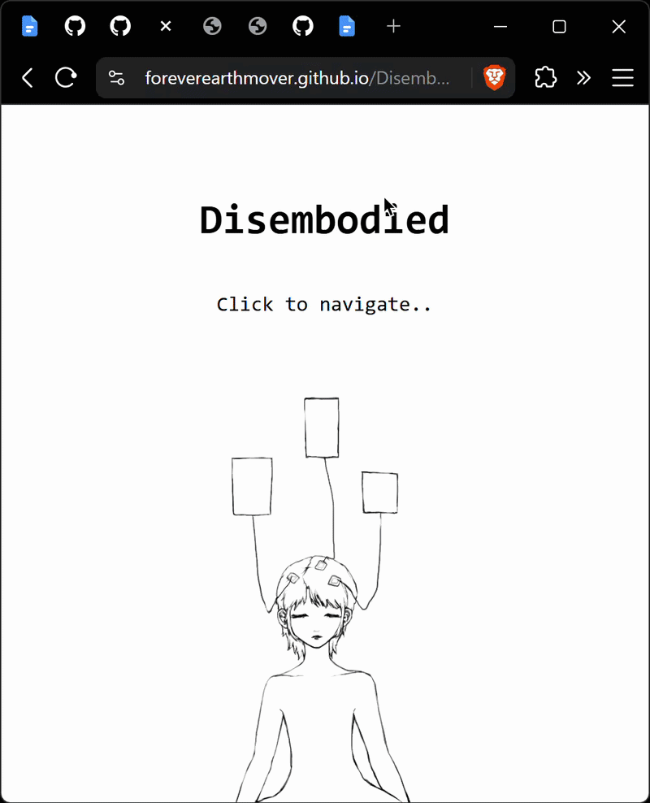

# Disembodied

🔗 https://foreverearthmover.github.io/Disembodied/  
## Description
In this project I used HTML, CSS and JavaScript to make a website showcasing three different interactive artworks. These artworks are located on subpages and are all thematically connected, namely through their reflection on how the way we see ourselves, others, and the world is changed through modern digital mediation. Each of the three artworks is supposed to reflect on one aspect (mind, body, world) of newly-emergent, digital experiences I‘ve made myself and observed in others.  
The concept comes from Katherine Hayles’ text “How We Became Posthuman” and is fundamentally about the loss of embodiment in multiple areas in life. 
In alignment with Technoshamanism and in agreement with Hayles herself, I appeal for the body and a return to autonomy and intuition.   

### Feature Image

### Navigation 
| Item                               | Description                                                              |
|------------------------------------|--------------------------------------------------------------------------|
| [index](index.html)                | The homepage allowing navigation to three subpages.                      |  
| [docs](./docs)                     | Documentation for the website.                                           |
| [images](./images)                 | Asset files are here.                                                    |
| [demos](./demos)                   | Older versions of the website's pages.                                   |
